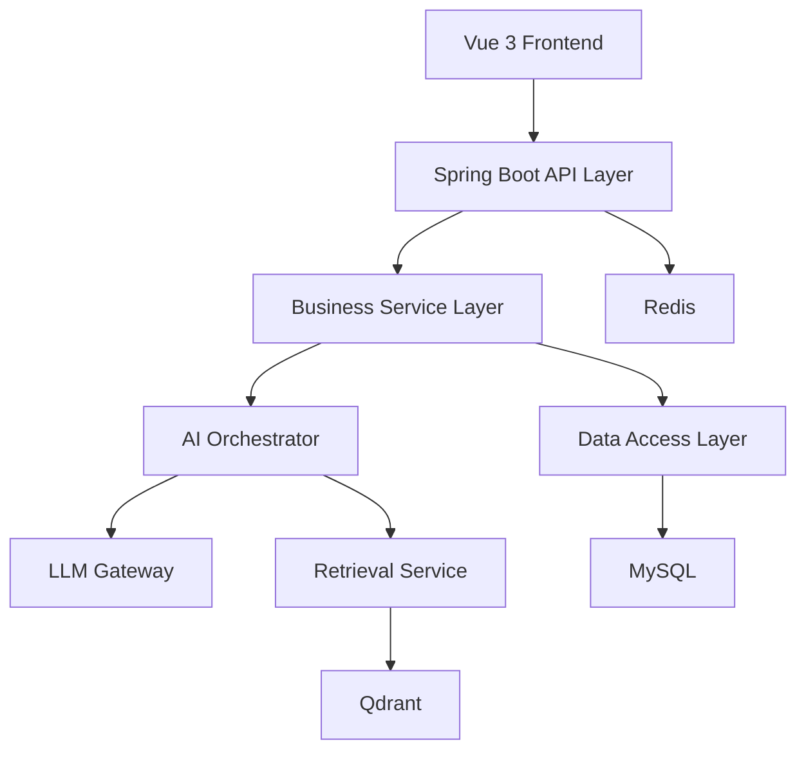
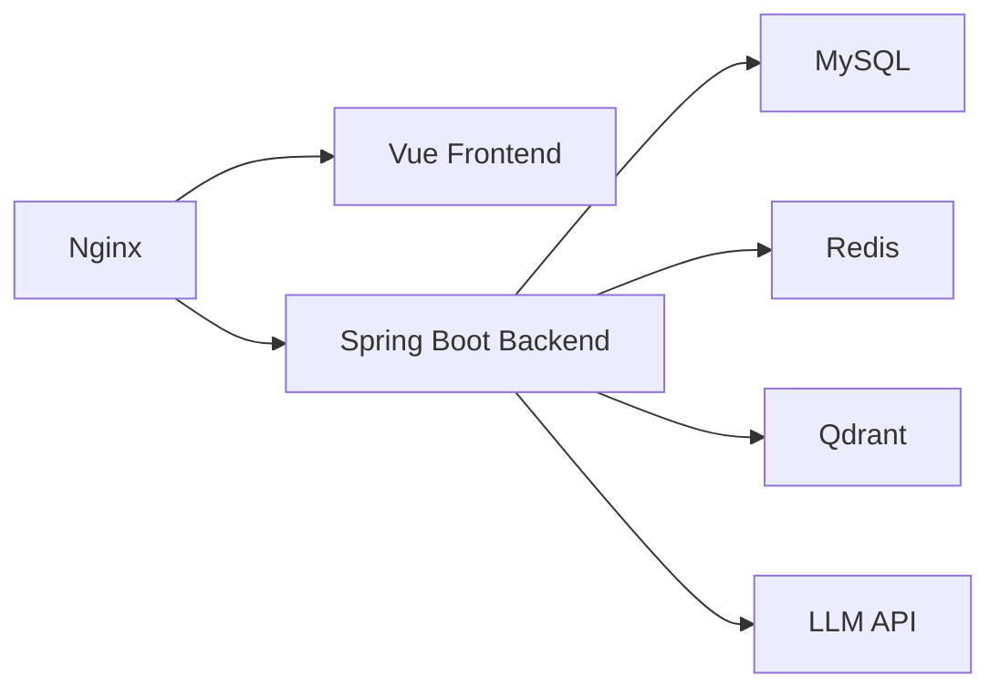

# ByteCoach 系统架构设计

## 1. 总体架构目标

ByteCoach 一期采用前后端分离的单体应用架构，优先保证开发效率、演示稳定性和后续扩展性。

目标原则：

- 单体部署，降低复杂度
- 分层清晰，便于后续扩展到 RAG 和 Agent
- 业务数据、缓存数据、向量数据分开存储
- AI 能力统一从后端封装

## 2. 技术栈

### 2.1 后端

- Java 17
- Spring Boot 3.x
- Maven
- MyBatis-Plus
- MySQL
- Redis
- Spring Security + JWT
- Hibernate Validator
- Knife4j / Swagger

### 2.2 前端

- Vue 3
- Vite
- TypeScript
- Pinia
- Vue Router
- Axios
- Element Plus
- Tailwind CSS

### 2.3 AI 与检索

- 大模型 API：一期接入单一供应商
- Embedding：与大模型供应商配套或兼容方案
- 向量数据库：推荐 Qdrant
- RAG：后端统一封装检索和上下文拼接能力

## 3. 系统分层

## 4. 模块划分

### 4.1 前端模块

- 登录注册模块
- Dashboard 模块
- Chat 问答模块
- Knowledge 知识库模块
- Interview 模拟面试模块
- Wrong 错题本模块
- Plan 学习计划模块
- Admin 管理入口模块（与用户端共用同一个 Vue 应用）

### 4.2 后端模块

- auth / user
- dashboard
- chat
- knowledge
- interview
- question
- wrong
- plan
- category
- ai

说明：

- `admin` 不作为独立业务域，仅体现为 `/api/admin/*` 管理接口前缀。
- 管理能力归属到 `question / knowledge / category` 三个领域模块内部。

## 5. AI 模块架构建议

### 5.1 LLM Gateway

职责：

- 统一封装模型调用
- 屏蔽不同模型供应商差异
- 提供标准化方法

建议提供的能力：

- chatCompletion
- answerWithContext
- scoreAnswer
- generateFollowUp
- generatePlan

### 5.2 PromptTemplateService

职责：

- 管理问答、评分、追问、学习计划的 Prompt 模板
- 支持后续做模板配置和版本管理

### 5.3 AiOrchestratorService

职责：

- 编排业务调用，而不是让业务模块直接调用模型
- 对输入进行上下文组织、引用拼接和结果转换

## 6. RAG 模块设计

一期即使做轻量版，也必须保留完整的扩展边界：

1. 文档入库
2. 文档切分
3. 向量化
4. 向量检索
5. 上下文拼接
6. LLM 回答生成
7. 引用片段返回

### 6.1 为什么要分层

如果把“检索 + 生成”写死在一个 Service 中，后续要接 rerank、替换向量库、优化召回策略时会非常难维护。

### 6.2 一期推荐做法

- 使用内置知识文档
- 将切分和向量化作为后台预处理
- 用户端只感知“知识库问答”

## 7. 存储职责划分

### 7.1 MySQL

存储业务主数据：

- 用户
- 会话
- 消息
- 文档元数据
- 题目
- 面试会话与答题记录
- 错题
- 学习计划与任务
- 分类

### 7.2 Redis

存储高频、短期、缓存类数据：

- JWT 黑名单或短时会话
- 热门首页统计缓存
- 限流计数
- 临时验证码或临时状态

### 7.3 向量数据库

存储向量数据与检索索引：

- 知识片段向量
- 向量元信息映射

阶段 1 约束：

- 保留 `RAG / Qdrant` 扩展边界
- 不把 `Qdrant` 作为本地启动必需组件

## 8. 安全性建议

- 登录接口增加基础限流
- 密码必须加密存储
- JWT 设置过期时间
- 接口统一鉴权和异常处理
- 管理端接口单独做角色校验
- 对 AI 输出进行基础清洗，防止前端展示风险内容
- 文件导入与解析能力后续开放时，需要校验文件类型和大小

## 9. 性能与风险点

### 9.1 可能的性能问题

- 首页聚合统计查询过多
- 会话消息过长导致接口响应变慢
- 检索链路和模型链路串行导致延迟高
- 面试评分连续多题调用模型导致成本和耗时上升

### 9.2 应对策略

- 首页统计做聚合缓存
- 会话消息分页加载
- 检索结果限制 TopK
- 面试每场题数控制在 3-5 题
- 统一设置模型超时与重试策略

## 10. 一期推荐部署架构

一期不建议上微服务，不建议拆分多个后端服务。先保证单体结构清晰，再考虑扩展。
