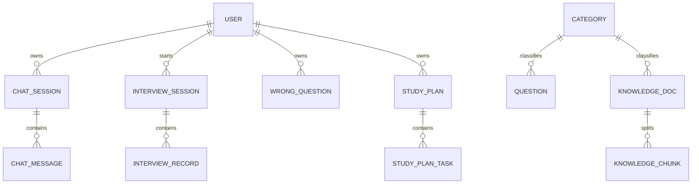

# ByteCoach 数据库设计

## 1. 设计原则

- 一期保持简单，但保留扩展位
- 优先满足闭环，而不是一次性覆盖全部想象功能
- 主数据落 MySQL
- 向量索引与业务表解耦

## 2. 核心表清单

一期建议保留和新增以下数据表：

### 2.1 基础与用户

- `user`
- `category`

### 2.2 问答与知识库

- `chat_session`
- `chat_message`
- `knowledge_doc`
- `knowledge_chunk`

### 2.3 面试与题库

- `question`
- `interview_session`
- `interview_record`

### 2.4 复习与计划

- `wrong_question`
- `study_plan`
- `study_plan_task`

## 3. 表结构建议

### 3.1 user

| 字段 | 类型 | 说明 |
| --- | --- | --- |
| id | bigint | 主键 |
| username | varchar(64) | 用户名 |
| password | varchar(255) | 密码摘要 |
| nickname | varchar(64) | 昵称 |
| avatar | varchar(255) | 头像 |
| email | varchar(128) | 邮箱 |
| role | varchar(32) | 角色 |
| status | tinyint | 状态 |
| source | varchar(32) | 注册来源 |
| remark | varchar(255) | 备注 |
| last_login_time | datetime | 最近登录时间 |
| create_time | datetime | 创建时间 |
| update_time | datetime | 更新时间 |

### 3.2 category

| 字段 | 类型 | 说明 |
| --- | --- | --- |
| id | bigint | 主键 |
| name | varchar(64) | 分类名称 |
| type | varchar(32) | 分类类型，question/knowledge/interview |
| sort_order | int | 排序 |
| status | tinyint | 状态 |
| create_time | datetime | 创建时间 |
| update_time | datetime | 更新时间 |

### 3.3 chat_session

| 字段 | 类型 | 说明 |
| --- | --- | --- |
| id | bigint | 主键 |
| user_id | bigint | 用户 ID |
| title | varchar(128) | 会话标题 |
| mode | varchar(32) | chat/rag |
| last_message_time | datetime | 最后消息时间 |
| create_time | datetime | 创建时间 |
| update_time | datetime | 更新时间 |

### 3.4 chat_message

| 字段 | 类型 | 说明 |
| --- | --- | --- |
| id | bigint | 主键 |
| session_id | bigint | 会话 ID |
| user_id | bigint | 用户 ID |
| role | varchar(16) | user/assistant/system |
| message_type | varchar(32) | text/answer/reference |
| content | text | 消息内容 |
| reference_json | json | 引用片段 JSON |
| create_time | datetime | 创建时间 |

### 3.5 knowledge_doc

| 字段 | 类型 | 说明 |
| --- | --- | --- |
| id | bigint | 主键 |
| title | varchar(128) | 文档标题 |
| category_id | bigint | 分类 ID |
| source_type | varchar(32) | 内置/导入 |
| file_url | varchar(255) | 文件路径 |
| summary | varchar(500) | 摘要 |
| status | varchar(32) | draft/parsed/vectorized |
| create_time | datetime | 创建时间 |
| update_time | datetime | 更新时间 |

### 3.6 knowledge_chunk

| 字段 | 类型 | 说明 |
| --- | --- | --- |
| id | bigint | 主键 |
| doc_id | bigint | 文档 ID |
| chunk_index | int | 分片序号 |
| content | text | 分片内容 |
| token_count | int | token 数 |
| vector_id | varchar(128) | 向量库索引 ID |
| create_time | datetime | 创建时间 |
| update_time | datetime | 更新时间 |

### 3.7 question

| 字段 | 类型 | 说明 |
| --- | --- | --- |
| id | bigint | 主键 |
| title | varchar(255) | 题目 |
| category_id | bigint | 分类 ID |
| type | varchar(32) | 题型 |
| difficulty | varchar(32) | 难度 |
| frequency | int | 频率 |
| tags | varchar(255) | 标签 |
| standard_answer | text | 标准答案 |
| score_standard | text | 评分标准 |
| source | varchar(32) | 来源 |
| create_time | datetime | 创建时间 |
| update_time | datetime | 更新时间 |

### 3.8 interview_session

| 字段 | 类型 | 说明 |
| --- | --- | --- |
| id | bigint | 主键 |
| user_id | bigint | 用户 ID |
| direction | varchar(64) | 面试方向 |
| status | varchar(32) | pending/running/finished |
| total_score | decimal(5,2) | 总分 |
| question_count | int | 题目数 |
| current_index | int | 当前题号 |
| start_time | datetime | 开始时间 |
| end_time | datetime | 结束时间 |
| create_time | datetime | 创建时间 |
| update_time | datetime | 更新时间 |

### 3.9 interview_record

| 字段 | 类型 | 说明 |
| --- | --- | --- |
| id | bigint | 主键 |
| session_id | bigint | 面试会话 ID |
| user_id | bigint | 用户 ID |
| question_id | bigint | 题目 ID |
| user_answer | text | 用户回答 |
| score | decimal(5,2) | 分数 |
| comment | text | 点评 |
| follow_up | text | 追问 |
| is_wrong | tinyint | 是否判定为错题 |
| create_time | datetime | 创建时间 |
| update_time | datetime | 更新时间 |

### 3.10 wrong_question

| 字段 | 类型 | 说明 |
| --- | --- | --- |
| id | bigint | 主键 |
| user_id | bigint | 用户 ID |
| question_id | bigint | 题目 ID |
| source_type | varchar(32) | interview/chat/manual |
| user_answer | text | 用户回答 |
| standard_answer | text | 标准答案 |
| error_reason | text | 错误原因 |
| mastery_level | varchar(32) | not_started/reviewing/mastered |
| review_count | int | 复习次数 |
| last_review_time | datetime | 最近复习时间 |
| create_time | datetime | 创建时间 |
| update_time | datetime | 更新时间 |

### 3.11 study_plan

| 字段 | 类型 | 说明 |
| --- | --- | --- |
| id | bigint | 主键 |
| user_id | bigint | 用户 ID |
| title | varchar(128) | 计划标题 |
| goal | varchar(255) | 学习目标 |
| content | text | 计划说明 |
| days | int | 学习天数 |
| status | varchar(32) | draft/active/completed |
| start_date | date | 开始日期 |
| end_date | date | 结束日期 |
| create_time | datetime | 创建时间 |
| update_time | datetime | 更新时间 |

### 3.12 study_plan_task

| 字段 | 类型 | 说明 |
| --- | --- | --- |
| id | bigint | 主键 |
| plan_id | bigint | 计划 ID |
| user_id | bigint | 用户 ID |
| task_date | date | 任务日期 |
| task_type | varchar(32) | review/question/interview/read |
| content | varchar(255) | 任务内容 |
| status | varchar(32) | todo/done |
| sort_order | int | 排序 |
| create_time | datetime | 创建时间 |
| update_time | datetime | 更新时间 |

## 4. 表关系设计



## 5. 一期数据库设计结论

对于 ByteCoach 一期，最关键的不是建很多表，而是把以下三个扩展点提前设计好：

- `knowledge_chunk`：支撑 RAG
- `interview_session`：支撑面试闭环
- `study_plan_task`：支撑计划执行闭环

只要这三个点补齐，数据库模型就既能支撑 MVP，也能平滑进入二期演进。

## 6. 一期约束补充

- `category.type` 只允许 `question / knowledge / interview`
- `chat_session.mode` 只允许 `chat / rag`
- `wrong_question.source_type` 一期只允许 `interview / chat`
- `Dashboard` 不新增独立统计表，统一通过业务表聚合或缓存得到

## 7. 索引与约束补充

### 7.1 wrong_question 唯一约束

```sql
UNIQUE KEY uk_user_question (user_id, question_id)
```

同一用户对同一道题只有一条错题记录，防止重复入错题本。应用层 `InterviewServiceImpl.addToWrongBook()` 已做先查后插，唯一约束作为安全兜底。

迁移脚本：[V2__wrong_question_unique_constraint.sql](/Users/cheers/Desktop/workspace/ByteCoach/sql/V2__wrong_question_unique_constraint.sql)

### 7.2 knowledge_chunk 内容检索

当前使用 `LIKE` 预过滤 + 内存关键词评分。后续可升级为 MySQL FULLTEXT INDEX（需配置 `ngram_token_size=2`）或向量数据库。
